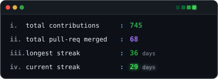

<div align="center">

```text
'########::::::::::'########::'########:'##::::'##:'########::'##:::'##:'########:'########::'######::
... ##..::::::::::: ##.... ##: ##.....::. ##::'##:: ##.... ##:. ##:'##::... ##..:: ##.....::'##... ##:
::: ##::::::::::::: ##:::: ##: ##::::::::. ##'##::: ##:::: ##::. ####:::::: ##:::: ##::::::: ##:::..::
::: ##::::'#######: ########:: ######:::::. ###:::: ########::::. ##::::::: ##:::: ######:::. ######::
::: ##::::........: ##.. ##::: ##...:::::: ## ##::: ##.... ##:::: ##::::::: ##:::: ##...:::::..... ##:
::: ##::::::::::::: ##::. ##:: ##:::::::: ##:. ##:: ##:::: ##:::: ##::::::: ##:::: ##:::::::'##::: ##:
::: ##::::::::::::: ##:::. ##: ########: ##:::. ##: ########::::: ##::::::: ##:::: ########:. ######::
:::..::::::::::::::..:::::..::........::..:::::..::........::::::..::::::::..:::::........:::......:::
```
</div>

<table width="100%">
  <!-- Row 1: Visual Identity & Code Profile -->
  <tr valign="middle">
    <td width="42%" align="center" valign="middle">
      <a href="https://tenor.com/view/lain-experiments-gif-202687086491934216">
        
      </a>
    </td>
    <td width="58%" valign="middle">

```cpp
// sourish.hpp
class SourishPanda {
public:
    string role = "B.Tech IT Student";
    string base = "Kolkata, India";
    vector<string> focus = {"AIML", "DSA", "Research"};
    vector<string> hobbies = {"Anime", "Music", "Gaming"};
    void message() {
        cout << "Colabing With Peers for Hacks & Research.";
    }
};

SourishPanda self;
self.message();
```
</td>
  </tr>

  <!-- Row 2: Terminal Links & Live Stats -->
  <tr valign="middle">
    <td width="42%" align="center" valign="middle">
      <a href="https://www.linkedin.com/in/sourish-panda81"></a>&nbsp;&nbsp;&nbsp;
      <a href="https://leetcode.com/u/t-rexbytes/"></a>&nbsp;&nbsp;&nbsp;
      <a href="https://discord.com/users/terex_24_"></a>&nbsp;&nbsp;&nbsp;
      <a href="https://instagram.com/terex_24"></a>&nbsp;&nbsp;&nbsp;
      <a href="https://www.kaggle.com/trexbytes"></a>
    </td>
    <td width="58%" valign="middle">
      
    </td>
  </tr>
</table>